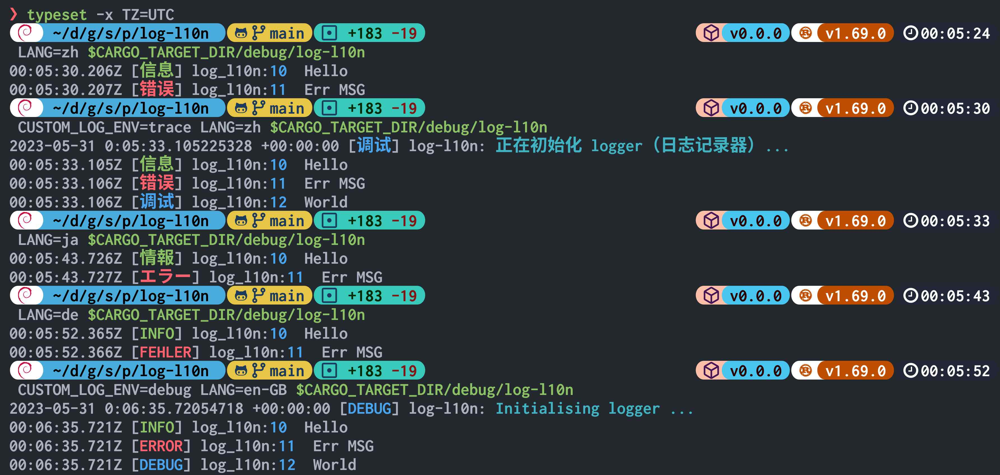

# Log-L10n

L10n support for log.

[](https://crates.io/crates/log-l10n)

[](https://docs.rs/log-l10n) [](./License)

## Quick Start

```sh
cargo add log-l10n --features=env-logger
cargo add log
```

```rust
use log_l10n::logger::{before_init, env_logger};

fn main() {
    let env_name = "CUSTOM_LOG_ENV";
    let pkg = log_l10n::get_pkg_name!();

    before_init(pkg, env_name);
    env_logger::init(env_name, Some("info"));

    log::info!("Hello");
    log::error!("Err MSG");
    log::debug!("World");
}
```


